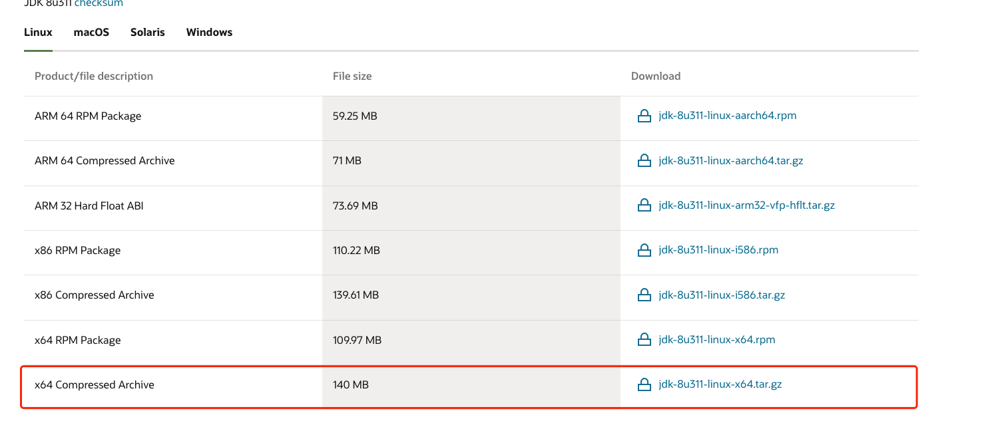

#1, 安装教程
```
https://www.cnblogs.com/stulzq/p/9286878.html
https://github.com/youxiang-yx/blog/blob/main/linux/Linux%E5%AE%89%E8%A3%85java.md
```
#2, JAVA下载地址
```
https://www.oracle.com/java/technologies/downloads/#java8
```
#3, 下载选择
```
ls -lht => 查看文件大小
```


#4，同步本地文件至远程服务器
```
1，mkdir /usr/local/java
2， scp 本地文件的目录 root@服务器ip:服务器目录
```

#5, 解压
```
tar -zxvf jdk-8u311-linux-x64.tar.gz
```

#6, 设置环境变量
```
1, vi /etc/profile

2,在文件末尾添加
export JAVA_HOME=/usr/local/java/jdk1.8.0_311
export JRE_HOME=${JAVA_HOME}/jre
export CLASSPATH=.:${JAVA_HOME}/lib:${JRE_HOME}/lib
export PATH=${JAVA_HOME}/bin:$PATH

3, 使环境变量生效
source /etc/profile

4, 添加软链接
ln -s /usr/local/java/jdk1.8.0_311/bin/java /usr/bin/java

5, 检查
java -version
```